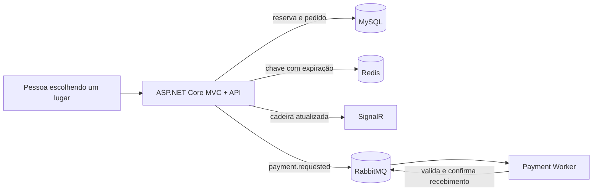

<div align="center">

# EventPass

### Do clique na cadeira à mensagem na fila.

Uma plataforma de ingressos em construção para estudar o que acontece **depois** que alguém escolhe um lugar: concorrência, expiração de reservas, atualização em tempo real e comunicação assíncrona.

**.NET 10** · **ASP.NET Core MVC** · **EF Core + MySQL** · **Redis** · **RabbitMQ** · **SignalR** · **xUnit**

</div>

---

## Por que fiz este projeto

Uma tela de compra pode parecer simples. Por trás dela, duas pessoas podem tentar reservar a mesma cadeira ao mesmo tempo; uma reserva pode expirar enquanto um pedido é criado; e o serviço de mensagens pode ficar indisponível depois que o pedido já foi salvo.

Estou construindo o EventPass para estudar esses problemas na prática, peça por peça. É um projeto de aprendizado, feito à mão e ainda em evolução. A intenção é experimentar tecnologias presentes em sistemas reais e entender **por que** cada uma entra no fluxo, não apenas colocá-las em uma lista de ferramentas.

## O que já acontece

1. A aplicação mostra um evento, seus setores e as cadeiras cadastradas no MySQL.
2. Ao reservar uma cadeira, a API usa um bloqueio de linha no MySQL e uma chave temporária no Redis para reduzir conflitos entre requisições.
3. A reserva vale por dez minutos. Um serviço em segundo plano procura reservas vencidas e libera as cadeiras.
4. O SignalR envia alterações de disponibilidade aos navegadores conectados.
5. Um pedido para uma reserva ativa é salvo no banco e uma mensagem `payment.requested` é publicada no RabbitMQ.
6. O worker consome e valida essa mensagem, com `Ack` e `Nack` explícitos.



> **Estado atual:** a interface de cartão e PIX é uma demonstração visual. O worker recebe e valida pedidos de pagamento, mas ainda não cobra o cliente, confirma pagamento ou emite ingresso. A página inicial também espera encontrar um evento com `EventId = 1` no banco.

## Onde cada tecnologia entra

| Tecnologia | Papel no projeto |
| --- | --- |
| ASP.NET Core MVC | Interface do evento e endpoints de reserva e pedido |
| Entity Framework Core + MySQL | Persistência de eventos, cadeiras, reservas e pedidos |
| Redis | Reserva temporária de cadeira com expiração e operação `SET NX` |
| SignalR | Aviso de alteração de cadeira para clientes conectados |
| RabbitMQ | Fila entre a criação do pedido e o worker de pagamento |
| .NET Worker Service | Consumo e validação das mensagens da fila |
| xUnit + SQLite | Testes unitários e testes de integração isolados do fluxo de pedidos |

O nome do repositório representa a direção de estudo. A solução já usa interfaces para alguns componentes, mas **a separação completa em camadas de Clean Architecture ainda é uma etapa futura**.

## Rodando localmente

### Pré-requisitos

- SDK do .NET 10 e ferramenta `dotnet-ef` para aplicar as migrations;
- MySQL, Redis e RabbitMQ ativos;
- RabbitMQ Management, caso queira configurar a política de dead letter pelo script incluído.

Configure as conexões no seu ambiente. A aplicação lê `ConnectionStrings:DefaultConnection`, `Redis:ConnectionString` e as opções `RabbitMQ` de configuração do ASP.NET Core. Para desenvolvimento local, prefira *user secrets* ou variáveis de ambiente e não publique credenciais reais no repositório.

```powershell
dotnet user-secrets set "ConnectionStrings:DefaultConnection" "server=localhost;port=3306;database=eventpass;user=SEU_USUARIO;password=SUA_SENHA" --project CleanArchitecture
dotnet user-secrets set "Redis:ConnectionString" "localhost:6379" --project CleanArchitecture
dotnet user-secrets set "RabbitMQ:Password" "SUA_SENHA" --project CleanArchitecture
dotnet user-secrets set "RabbitMQ:Password" "SUA_SENHA" --project EventPass.PaymentWorker

dotnet restore CleanArchitecture.slnx
dotnet ef database update --project CleanArchitecture --startup-project CleanArchitecture
```

Confira também `RabbitMQ:Host`, `RabbitMQ:Port` e `RabbitMQ:User` nos arquivos de configuração, ajustando-os se sua instalação não usa os valores locais. A página inicial busca o evento com `EventId = 1`. Em um banco recém-criado, estes dados mínimos permitem explorar o mapa de cadeiras:

```sql
INSERT INTO Events (EventId, Name, Venue, StartsAt, ImageUrl, IsActive)
VALUES (1, 'EventPass Demo', 'Arena Demo', DATE_ADD(UTC_TIMESTAMP(), INTERVAL 30 DAY), NULL, 1);

INSERT INTO Sectors (EventId, Name, Price)
VALUES (1, 'Pista', 120.00);

SET @sector_id = LAST_INSERT_ID();
INSERT INTO Seats (SectorId, `Row`, Number, Status)
VALUES (@sector_id, 'A', 1, 'Available'),
       (@sector_id, 'A', 2, 'Available'),
       (@sector_id, 'A', 3, 'Available');
```

Em terminais separados:

```powershell
dotnet run --project CleanArchitecture --launch-profile http
```

```powershell
dotnet run --project EventPass.PaymentWorker
```

A aplicação web usa `http://localhost:5082` no perfil `http`. O endpoint de reserva é `POST /api/reservations` e o de pedido é `POST /api/orders`; ambos recebem o **ID numérico da cadeira** como corpo JSON.

Para associar a fila de pagamentos à dead letter exchange, há o script [`Configure-RabbitMqDeadLetterPolicy.ps1`](CleanArchitecture/Scripts/Configure-RabbitMqDeadLetterPolicy.ps1). Ele usa a API de gerenciamento do RabbitMQ e deve ser executado com as credenciais e a porta do seu ambiente.

## Testes

```powershell
# Suíte completa: testes locais + Redis e RabbitMQ reais
dotnet test CleanArchitecture.slnx

# Apenas os testes que não exigem Redis ou RabbitMQ ativos
dotnet test CleanArchitecture.slnx --filter 'Category!=ExternalInfrastructure'
```

Na última execução da suíte completa, **13 testes passaram**. Eles cobrem validação de mensagens, respostas dos controllers, persistência de pedidos com SQLite, exclusividade da chave Redis e roteamento de mensagens no RabbitMQ. Os testes externos usam recursos temporários; veja as variáveis de ambiente e os limites de cobertura em [`TESTING.md`](TESTING.md).

## Próximas etapas

- [ ] Processar o pagamento de fato e atualizar o estado do pedido e da cadeira;
- [ ] Usar *outbox* para evitar que um pedido salvo fique sem mensagem quando o RabbitMQ falhar;
- [ ] Tornar o consumo idempotente e fortalecer as regras de concorrência;
- [ ] Cobrir o fluxo de reservas com testes de integração em MySQL isolado;
- [ ] Evoluir a divisão entre domínio, aplicação, infraestrutura e apresentação;
- [ ] Preparar dados de demonstração e uma forma reproduzível de subir toda a infraestrutura.

---

<div align="center">

**Um projeto de estudo aberto à evolução.** Cada problema encontrado aqui é uma oportunidade de entender melhor como sistemas reais se comportam.

</div>
